Praktikum
1. Tugas 1
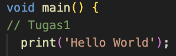
Hasil :
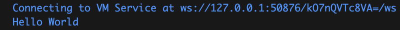
Penjelasan :
- Fungsi dari print adalah untuk menampilkan data saat program dijalankan, pada kode diatas data yang ditampilkan yaitu kata 'Hello World'. Fungsi tanda ' ' adalah untuk menandai bahwa yang ditampilkan adalah sebuah kata, sehingga hasil yang ditampilkan ketika program dijalankan adalah kata yang berada didalam tanda ' ' yaitu : Hello World.

2. Tugas 2
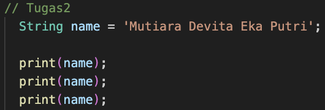
Hasil :
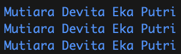
Penjelasan :
- String nama adalah variabel yang digunakan untuk menyimpan nilai.
- String adalah sebuah tipe data yang digunakan untuk menyimpan barisan karakter.
- nama digunakan untuk memanamai variabel tersebut.
- tanda ' ' digunakan untuk menunjukan bahwa data bertipe string.
- print digunakan untuk menampilkan nilai variabel.

3. Tugas 3
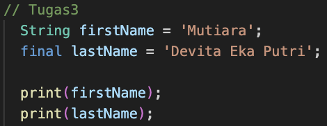
Hasil : 
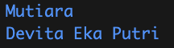
Penjelasan :
- Final digunakan untuk menandai bahwa nilai dari variabel tersebut tidak dapat diubah.
- Kode diatas dipisah dalam dua variabel, yaitu firstName dengan tipe data String dan lastName dengan tipe data final, sehingga memiliki nilai yang bebeda disetiap variabelnya.

4. Tugas 4.1
Hasil :
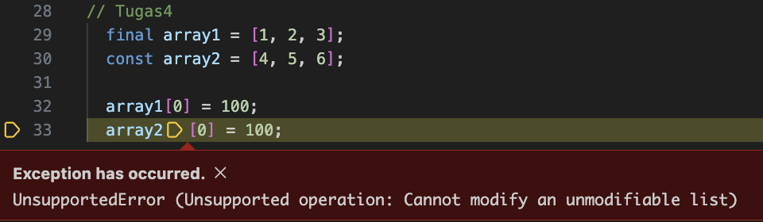
Penjelasan :
- Array merupakan variabel yang dapat menyimpan banyak nilai dalam satu variabel. Ditandain dengan [nilai1, nilai2, dst].
- array1 memiliki tipe data final dan array2 memiliki tipe data const dimana kedua tipe data ini menjelaskan bahwa nilai variabel tersebut tidak dapat diubah-ubah.
- Pada baris 32 dan 33 menunjukan bahwa nilai array pada indeks 0 akan diubah menjadi angka 100, hal ini akan terjadi error karena tipe data final dan const tidak dapat diubah.

Tugas 4.2
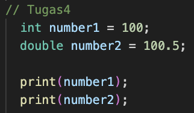
Hasil :
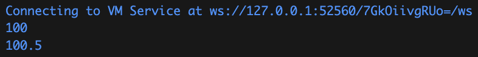
Penjelasan :
- int adalah tipe data untuk menyimpan nilai berupa angka
- double adalah tipe data untuk menyimpan nilai berupa angka desimal

5. Tugas 5
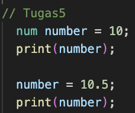
Hasil :
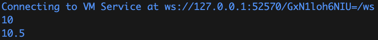
Penjelasan :
- num adalah bentuk lebih luas dari int dan double.
- num dapat menyimpan semua angka antara int dan double.

6. Tugas 6 
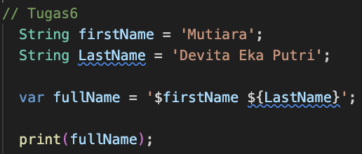
Hasil :
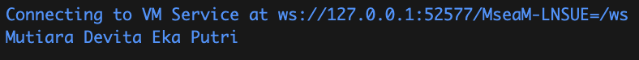
Penjelasan :
- var adalah tipe data yang dapat menampung semua jenis nilai berkarakter maupun angka.
- Kode diatas digunakan untuk menyimpan nilai dari variabel firstName dan lastName yang disimpan dalam var dengan nama fullName.

7. Tugas 7
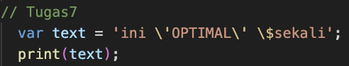
Hasil :
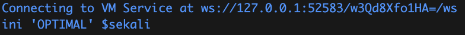
Penjelasan :
- Tanda \ berfungsi untuk menampilkan karakter lain didalam karakter.

8. Tugas 8
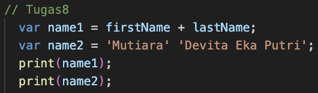
Hasil :
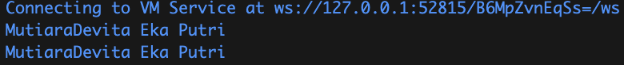
Penjelasan :
- Pada name1 nilai diambil dari variabel firstName dan lastName dan digabungkan tanpa pemisah.
- Pada name2 nilai langsung di inisialisasi pada variabelnya dengan tanda ' ' sendiri dan menghasilkan nilai tanpa pemisah.

9. Tugas 9
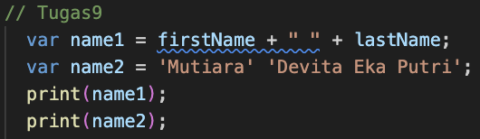
Hasil :
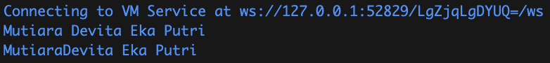
Penjelasan :
- Penambahan " " pada name1 maka menghasilkan sebuah pemisah berupa spasi.
- name2 sebelum karakter pertama pada nilai kedua ditambahkan spasi sehingga menjadi pemisah dengan nilai sebelumnya.

10. Tugas 10
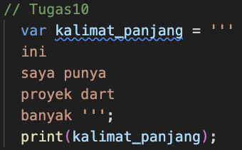
Hasil :
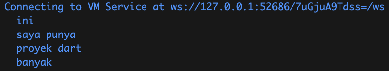
Penjelasan :
- Tanda ''' ''' digunakan untuk mendefinisikan string panjang yang dapat mencakup multiple baris. Sehingga nilai yang ditampilkan dapat menampilkan kalimat yang panjang.